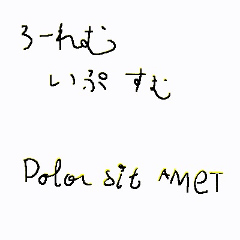

[すべあな2枠の文字落下アニメ](https://youtu.be/7CUpc5K1li4?si=0xJK614teAC51llY&t=189)をpymunkとpygameでやる。



# 必要なPythonライブラリ
`requirements.txt`にまとめといた。

# ファイル構成
`script`ディレクトリ直下のPythonライブラリが、アニメーションを作る用のやつ

スクリプトにパラメータがあるので、好きに自分でいじってくれ。

`script/lib`はファイル分けしたくて分けた

`Assets`にある画像が元のやつ。

`step1*.py`を実行したら`Export`ディレクトリにクロップした画像群が生成される。

`position.txt`は切り出す座標とその幅や高さのリスト。の例。各ステップのスクリプトで共通。

`step2*.py`を実行したらPymunkで物理演算しながらPygameでアニメーションを可視化する。

# 想定した使い方の例
1. Peingで字幕を作成し、画像を保存
2. そのうち重力アニメにしたい部分の全体をクロップする
3. 背景を作っておく
4. GIMP等で落下させたい文字の各文字を長方形で切り抜くとしたらどこなのかとか、どこを固定の物体にしときたいのかをメモってテキストファイルにしとく
5. てか、事前に文字の画像は透過しとくといい
6. step1から始まるスクリプトを実行して`Export`ディレクトリ下に画像を生成する。
7. step2のスクリプトでPygameで表示させながら実際に映像にする。パラメータを変えると各フレームの画像を出力。
8. 各フレームは`ffmpeg -i path/to/frame_%05d.png DONE.webm`のようにして動画に変換する。

# 実行例
最初に、Peingで字幕を作成し、重力のアニメーションの適用をしたい箇所を画像として保存する。

その画像を、背景部分と文字部分に分ける(例：`Assets/{BG.png, char.png}`)。このとき後者は透過pngにすること。

`char.png`について、

* 落下させたい文字の各文字
* 足場としたい文字列

の箇所を長方形による領域(左上の座標、幅、高さ)のリストで表現する。ファイル例`position.txt`を参照せよ：

```
# dynamic characters
# syntax: x1 y1 w h
# if just x1 then y1, w, h are as in previous line

__DYNAMIC__

40 59 41 57
76
114 59 52 57
165 66 68 59

# -- snif --

__FIXED__

# --- snif ---
```

各文字と文字列を切り出す：

```terminal
./script/step1-crop.py Assets/char.png position.txt
```

この結果、`Export`ディレクトリにて`dynamic_*.png`と`fixed_*.png`が生成される。

次に、生成した画像群でアニメーションを作る。まず、`step2-gravity.py`のソースコード上のパラメータを編集する。その上で、

```terminal
./script/step2-gravity.py ./Export/ ./position.txt ./Assets/BG.png 
```

この際、もしもフレームを画像化するようにしているのであれば、`VideoFrames`ディレクトリにて各フレームが画像として出てる。


# 課題
* 文字の切り出しを手作業でやるだなんて。逆に、テキストから画像を作るのが先なのではないか。
  * そりゃ作風の都合にもよるからね。
* 「い」「私」などの各画が離れた文字をポリゴンにするやつをどうにかした方がよい。各部分を独立的にポリゴンにした後に無理矢理ピン止めしてるもんだから、挙動がなんかおかしいように見える。
* てか、単純なポリゴンに近似させた方がよい。

好きに改造してくれ。

# ライセンス
ISCライセンス。画像も。
